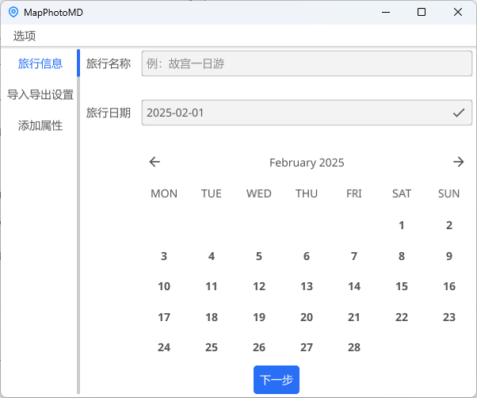
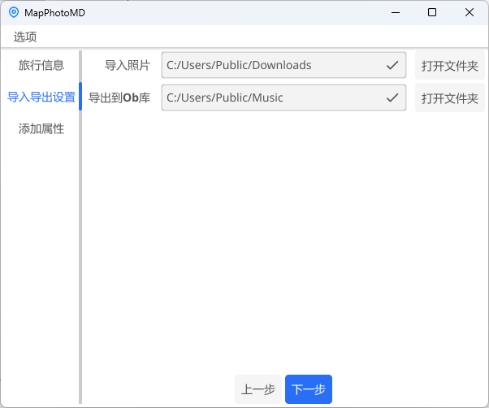
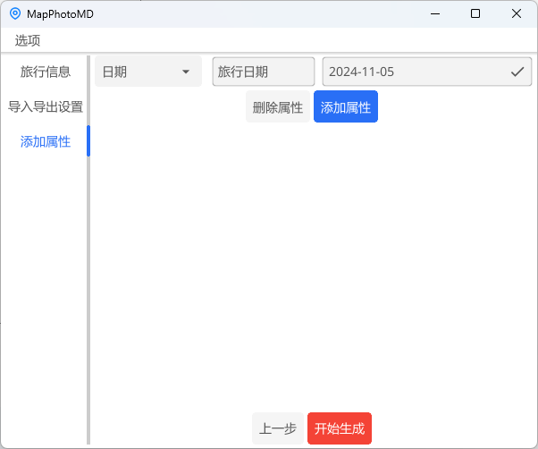

# 功能与特性

MapPhotoMD是一个基于Go和Fyne的小工具。它可以读取照片的位置信息，并用这些信息生成符合Obsidian和Obsidian-Leaflet规范的旅行记录文档，配合Obsidian-Leaflet插件，可以无缝地将照片显示到在线地图上。

它还具有以下特性：

+ 可视化地添加、删除、编辑文档属性，这些属性将保存到文档开头
+ 可选择是否将照片转存到指定文件夹
+ 可选择在转存后是否删除原照片

> 灵感来自[这个Python脚本](https://sspai.com/post/80578)

# 如何使用

## 前期工作

+ 申请高德地图的Key
  + 进入[高德开放平台](https://lbs.amap.com/)，注册登录
  + 进入控制台，点击`应用管理`-`我的应用`-`创建新应用`，填写应用名称（Obsidian或其他皆可）、应用类型（工具或其他皆可）
  + 点击`添加Key`，输入Key名称（leaflet或其他皆可），服务平台选择Web服务，提交
  + 保存下生成的Key，后面会用到，**不要透露给其他人**
+ 安装并修改Obsidian-Leaflet插件
  + 进入Ob第三方插件商店，搜索Leaflet，安装并启用
  + 修改地图缩放限制
    + 找到插件所在目录，默认为Ob库下的`\.obsidian\plugins\obsidian-leaflet-plugin`
    + 打开`main.js`文件，将文件中的`maxzoom:10`全部换成`maxzoom:18`
    + 保存后重启Obsidian
+ 确保照片都带有位置信息
  + 拍照时**打开GPS定位**
  + 手机相册发送照片到电脑时，**关闭抹除照片位置信息的设置**；也可以用其他软件发送照片，如[LocalSend](https://github.com/localsend/localsend)
  + 将照片放在**同一个文件夹**里

## 开始使用

本软件是绿色、免安装软件，下载软件后双击打开即可使用。

> 第一次运行时，软件会尝试读取配置文件，因为没有配置文件，因此会弹出windows通知进行提醒，可能会被杀毒软件拦截通知，请放行，本软件安全无毒

+ 填写必要设置
  + 点击`选项`-`设置`
  + 填入之前保存的高德Key
  + Ob库路径填写你希望将旅行记录存放在Ob库中的哪个文件夹下，如`生活/旅游`
  + 按需选择是否转存照片、是否删除原照片、是否保存文件属性
    + 转存照片选否时，不会删除原照片
    + 转存照片选是时，照片会默认保存到旅行文档的`./pictures`，也可以另外指定转存文件夹
  + 点击保存

+ 填写旅行信息
  + 为你的旅行取一个名字并填入
  + 点击日历，选择旅行开始的第一天

+ 填写导入导出设置，选择照片所在文件夹和旅行记录文档存放文件夹

+ 填写保存到旅行文档的属性
  + 软件会检查属性值的格式，以确保生成结果符合Obsidian和Obsidian-Leaflet的规范

+ 点击开始生成，在Ob中查看生成的旅行文档
  + 当导入照片文件夹中存在没有位置信息的照片时，会有对话框显示这些照片的文件名

# 路线图

- [x] 保存导入导出路径
- [x] 显示生成进度
- [x] 集成图片压缩功能

# 反馈问题

可以提交issue，也可以通过[我的博客](https://www.huangoo.top)、我的邮箱（1165011707@qq.com）联系我。软件中也有相关跳转按钮。

# 许可证

本软件采用MIT许可证，详情参见[LICENSE](LICENSE)文件。

# 鸣谢

本软件受益于以下项目和文章，非常感谢：

+ [StarAire](https://sspai.com/post/80578)
+ [Go](https://github.com/golang/go)
+ [Fyne](https://github.com/fyne-io/fyne)
+ [Go-EXIF](https://github.com/rwcarlsen/goexif)

